# AI Fashion Collective
혁신적인 인공지능 기반 패션 플랫폼 - 집단 창작이 핵심 개념



## 프로젝트 개요
본 프로젝트는 특허 출원 중인 인공지능을 이용한 패션플랫폼 기술(출원번호: 10-2022-0151706, 공개번호: 10-2024-0070763)을 구현한 것입니다. 다수의 사용자들이 참여하여 의류 디자인에 대한 평가와 수정을 공동으로 진행하고, 인공지능이 이를 학습하여 최적의 디자인을 완성하는 시스템입니다.

## 주요 기능

### 1. 디자인 제안부 (Design Proposal Component)

- 의류 디자인을 다수의 사용자들에게 제시
- 사용자들의 평가를 반영한 인공지능 생성 디자인 표시
- 실시간으로 수정된 디자인 업데이트

### 2. 평가 입력부 (Evaluation Input Component)

- 다수 사용자들의 의류 디자인 직접 평가 기능
- 인공지능 디자인 툴을 통한 디자인 수정 지원
- NFT/블록체인 통합으로 사용자 정보 관리
- 오브젝트 감지, 변환, 렌더링 기능 제공

### 3. 인공지능 디자인 완성부 (AI Design Completion Component)

- 사용자들의 평가를 기반으로 인공지능이 디자인 완성
- 실시간 수정 사항 반영
- 사용자 선호도와 디자인 패턴 학습

### 4. 디자인 개시부 (Design Display Component)
- 완성된 디자인을 사용자별로 개별 제공
- 사용자 맞춤형 디자인 제시

## 인공지능 디자인 툴
1. **오브젝트 감지 (Object Detection)**
   - 이미지 내 의류 오브젝트 식별 및 구분
   - 인공지능 학습 기반 정확한 오브젝트 추출

2. **변환 (Transformation)**
   - 감지된 오브젝트 분할(segmentation)
   - 이원화(binarization) 처리
   - 사용자가 원하는 오브젝트 스케치 추출

3. **렌더링 (Rendering)**
   - 변환된 오브젝트에 다양한 질감 적용
   - 사용자 선택 텍스처 자동 적용

4. **모델 적용 (Model Application)**
   - 3D 의류 디자인을 가상 모델/아바타에 적용
   - 다양한 포즈와 움직임 시뮬레이션

5. **인공지능 패턴 추출 (AI Pattern Extraction)**
   - 의류 디자인의 실루엣으로부터 패턴 자동 생성
   - 기하학적 구조 분석을 통한 패턴 제작

## 기술 스택
- **프론트엔드**: React.js, Material-UI, Three.js (3D 렌더링)
- **백엔드**: Node.js, Express, MongoDB
- **인공지능**: TensorFlow, PyTorch, OpenCV
- **블록체인**: Web3.js, IPFS (NFT 구현)

## 설치 및 실행
```bash
# 저장소 복제
git clone https://github.com/JJshome/ai-fashion-collective.git
cd ai-fashion-collective

# 의존성 설치
npm install

# 개발 서버 실행
npm start
```

## 특허 정보
- **출원번호**: 10-2022-0151706
- **출원일자**: 2022년 11월 14일
- **공개번호**: 10-2024-0070763
- **공개일자**: 2024년 05월 22일
- **출원인/발명자**: 장지환

## 라이선스
본 프로젝트는 특허 출원 중인 기술을 기반으로 구현되었으며, 모든 권리는 출원인에게 있습니다.


## [English Description]
# AI Fashion Platform
A modern platform leveraging artificial intelligence to enable collective design creation and evaluation in fashion. This project is based on a patent filed by Ucaretron Inc. (Patent Publication No. 10-2024-0070763).


## Overview
This platform allows multiple users to collaboratively evaluate and modify fashion designs, with AI technology assisting in completing these designs based on collective user input. The system provides tools for object recognition, texture rendering, 3D modeling, and pattern extraction.

## Key Features
### 1. Collective Design Creation
- Design Proposal: Present initial designs to users
- Real-time Collaboration: Multiple users can provide feedback simultaneously
- AI-Powered Synthesis: Combine inputs from various users into cohesive designs

### 2. AI Design Tools
- Object Detection: Identify clothing items within images
- Texture Rendering: Apply and modify textures to clothing objects
- 3D Model Application: Visualize designs on virtual models and avatars
- Pattern Extraction: Generate clothing patterns from silhouettes

### 3. Smart Evaluation System
- Collect User Feedback: Gather ratings and specific evaluations
- Sentiment Analysis: Analyze user comments and suggestions
- Intelligent Recommendations: Generate AI suggestions based on collective input

### 4. Blockchain Integration
- NFT Support: Create unique tokens for designs
- Secure User Verification: Track user contributions through blockchain
- Transparent Attribution: Maintain clear ownership records

## Technical Architecture
The platform follows a microservices architecture with the following components:

- Frontend: React.js with Material-UI
- Backend API: Express.js and Node.js
- AI Services: Python with TensorFlow/PyTorch
- Database: MongoDB for user data and design information
- Real-time Communication: Socket.io for collaborative features
- Blockchain Integration: Web3.js for NFT and verification

## Getting Started
### Prerequisites
- Node.js (v16+)
- MongoDB
- Python 3.8+ (for AI components)
- TensorFlow 2.x
- PyTorch 1.x

### Installation
```bash
# Clone the repository
git clone https://github.com/JJshome/ai-fashion-platform.git
cd ai-fashion-platform

# Install dependencies
npm install
pip install -r requirements.txt

# Setup environment variables
cp .env.example .env
# Edit .env with your configuration

# Start the development server
npm run dev
```

## Project Structure
```
ai-fashion-platform/
├── backend/               # Backend API server
│   ├── config/            # Configuration files
│   ├── controllers/       # API controllers
│   ├── models/            # Database models
│   ├── routes/            # API routes
│   ├── services/          # Business logic services
│   └── server.js          # Server entry point
├── frontend/              # React frontend
│   ├── public/            # Static files
│   └── src/               # Source code
│       ├── components/    # React components
│       ├── context/       # React context providers
│       ├── pages/         # Page components
│       └── App.jsx        # Main component
├── ai/                    # AI services
│   ├── object_detection/  # Object detection models
│   ├── texture_rendering/ # Texture application models
│   ├── model_application/ # 3D modeling services
│   └── pattern_extraction/ # Pattern generation models
└── README.md              # Project documentation
```

## Key Components from the Patent
This implementation is based on the following patent components:

### Design Proposal Component (디자인 제안부)

- Presents fashion designs to multiple users
- Displays AI-generated designs based on user evaluations
- Supports real-time updates of modified designs

### Evaluation Input Component (평가 입력부)

- Allows multiple users to evaluate fashion designs
- Provides AI-powered design tools for users to modify designs
- Supports NFT/blockchain integration for user information

### AI Design Completion Component (인공지능 디자인 완성부)

- Completes clothing designs using AI based on user evaluations
- Reflects real-time modifications in the design
- Learns from user preferences and design patterns

### Design Display Component (디자인 개시부)
- Presents completed designs individually to each user
- Tailors display based on user preferences

## Patent Information
This project is based on patent-pending technology:

- Patent Publication No: 10-2024-0070763
- Publication Date: 2024-05-22
- Applicant: Ucaretron Inc.
- Inventor: Jang Ji-hwan

See PATENT_INFO.md for more details.

## Contributing
Contributions are welcome! Please feel free to submit a Pull Request.

## License
This project is proprietary and based on patent-pending technology by Ucaretron Inc. All rights reserved.

## Acknowledgements
- Special thanks to the research team at Ucaretron Inc.
- This platform is based on the patent filing for "AI-based Fashion Platform" (Patent Publication No. 10-2024-0070763)
